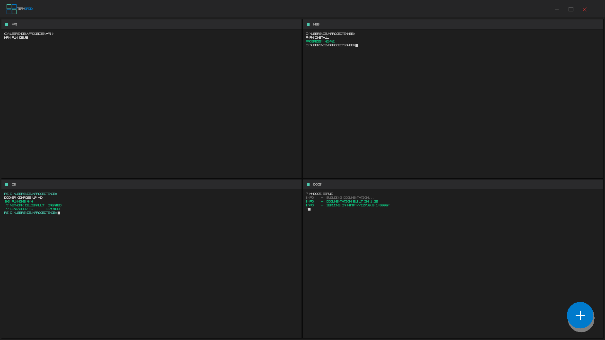
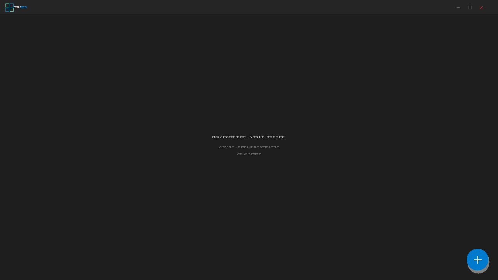
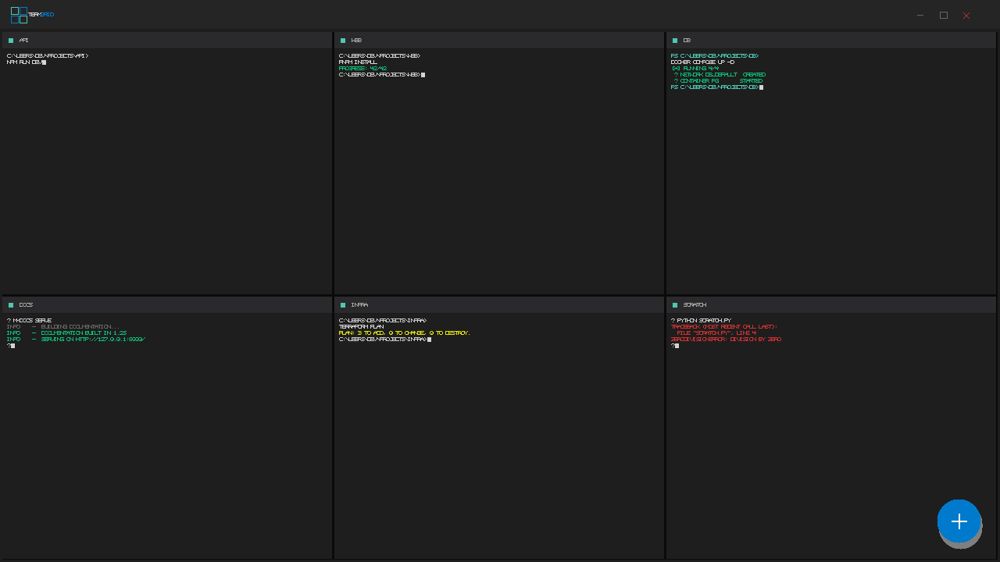

<div align="center">


# TermGrid

**All your project terminals in one window, side by side.**

A grid-style terminal panel for Windows. Open as many CMD / PowerShell sessions as you need, see them all at once, no more juggling windows.

[](LICENSE)
[](#requirements)
[](https://www.electronjs.org)
[](https://nodejs.org)

[Screenshots](#screenshots) · [Features](#features) · [Quick Start](#quick-start) · [Usage](#usage) · [Architecture](#architecture) · [Contributing](CONTRIBUTING.md)

</div>

---

## Why TermGrid

Working on multiple projects usually means a taskbar full of overlapping CMD windows. Switching between them breaks context and clutters the screen.

TermGrid puts every terminal into a single window as an auto-arranging grid. One keystroke or click spawns a new cell pointed at any folder you choose.



## Screenshots

| Empty state | 2×2 grid | 3×2 grid |
|:---:|:---:|:---:|
|  |  |  |

Screenshots are generated from `scripts/build-screenshots.js` to mirror the live app. Run `npm run screenshots` to refresh them.

## Features

- **Auto-arranging grid** — 1→1×1, 2→2×1, **4→2×2**, 6→3×2, 9→3×3, 10+ → ⌈√n⌉ columns.
- **One-click spawn** — floating action button or `Ctrl+G` opens a folder picker and drops a new terminal there.
- **Native dark chrome** — Windows 10/11 dark title bar with overlaid window controls.
- **Themed scrollbars** — dark, minimal, no jarring white bars.
- **Real terminal** — ConPTY + xterm.js with full ANSI / 256-color support.
- **Sandboxed renderer** — `contextIsolation: true`, `nodeIntegration: false`, IPC-mediated API only.

## Quick Start

### Run from source

Requirements: **Node.js 18+** on **Windows 10 1809+** (or Windows 11).

```bash
git clone https://github.com/mayberks/termgrid.git
cd termgrid
npm install
npm start
```

`node-pty` ships with prebuilt Windows binaries — no compiler required.

### Use the portable build

1. Open the [Releases](https://github.com/mayberks/termgrid/releases) page.
2. Download the latest `TermGrid-portable.exe`.
3. Run it — no installer needed.

## Usage

| Shortcut | Action |
|---|---|
| `Ctrl + G` | Open the folder picker and spawn a new terminal |
| Click `+` (bottom-right) | Same as above |
| Click `×` on a cell header | Close that terminal |
| Hover a cell header | Reveal the close button |

### Grid layout rules

The grid resizes automatically as terminals are added or removed:

| Cells | Layout |
|---:|:---|
| 1 | 1×1 |
| 2 | 2×1 |
| 3 | 3×1 |
| **4** | **2×2** |
| 5 – 6 | 3×2 |
| 7 – 9 | 3×3 |
| 10+ | ⌈√n⌉ columns |

See [`src/renderer/grid.js`](src/renderer/grid.js) for the implementation.

## Architecture

```
┌──────────────┐  IPC   ┌───────────────┐  PTY   ┌─────────┐
│   Renderer   │ ◄────► │  Main process │ ◄────► │  cmd.exe│
│ (xterm.js)   │        │ (PtyManager)  │        │ (ConPTY)│
└──────────────┘        └───────────────┘        └─────────┘
       ▲                          │
       │      contextBridge       │
       └────── preload.js ────────┘
```

### Process responsibilities

- **Main process** owns the PTY processes. `PtyManager` keeps a `Map<id, IPty>` and exposes `spawn`, `write`, `resize`, `kill`, `killAll`.
- **Preload** is the only bridge between main and renderer. It exposes a minimal `window.api` via `contextBridge`.
- **Renderer** is a plain browser context. `terminal.js` encapsulates one xterm + DOM cell; `main.js` wires IPC events and the grid layout.

### Project layout

```
termgrid/
├── src/
│   ├── main/                Electron main process
│   │   ├── index.js           app lifecycle, branding
│   │   ├── window.js          BrowserWindow + dark title bar
│   │   ├── pty-manager.js     PtyManager class
│   │   └── ipc.js             IPC handler registry
│   ├── preload/
│   │   └── preload.js         contextBridge — sandboxed API
│   └── renderer/            Chromium renderer
│       ├── index.html
│       ├── styles.css         theme + layout
│       ├── grid.js            grid sizing logic
│       ├── terminal.js        Terminal class (xterm + DOM)
│       └── main.js            renderer entry
├── build/                  Generated icons + screenshot assets
├── scripts/
│   ├── build-icons.js         SVG → PNG → ICO
│   └── build-screenshots.js   README screenshots
├── docs/screenshots/       PNGs used in README
├── .github/                Issue & PR templates
├── package.json
├── LICENSE                  MIT
├── CHANGELOG.md
├── CONTRIBUTING.md
├── README.md
└── SECURITY.md
```

## Development

### Prerequisites

| | |
|---|---|
| Node.js | 18 or newer |
| OS | Windows 10 1809+ / Windows 11 |
| Disk | ~500 MB for `node_modules` |

### Scripts

```bash
npm start          # run in dev mode (electron .)
npm run icons      # regenerate icon.png and icon.ico
npm run screenshots # regenerate README screenshots
npm run pack       # unpacked build for local testing
npm run build      # portable .exe (runs icons + screenshots first)
```

### Adding a new IPC channel

1. Add a handler in [`src/main/ipc.js`](src/main/ipc.js).
2. Expose it on `contextBridge` in [`src/preload/preload.js`](src/preload/preload.js).
3. Call it from the renderer.

## Building distributables

```bash
npm run build
```

Output: `dist/TermGrid <version>.exe` (~73 MB, single-file, no install).

Configuration lives in the `build` field of [`package.json`](package.json).

## Troubleshooting

**`npm install` fails with `gyp ERR! find Python`**

`node-pty` ships prebuilt Windows binaries, so this should not happen. If it does, install Node.js 18+ and clear `node_modules` before retrying.

**The window opens but the folder picker never appears**

Open DevTools with `Ctrl+Shift+I` → Console. If you see `Cannot read properties of undefined (reading 'selectFolder')`, the preload script failed to load — verify [`src/preload/preload.js`](src/preload/preload.js) is included in `build.files`.

**Terminals render but colors look wrong**

Set `TERM=xterm-256color` in the shell environment. TermGrid sets this automatically via `PtyManager.spawn`.

**Dark title bar not showing**

Requires Windows 10 1903+ or Windows 11. Older versions fall back to the OS default.

## Contributing

See [CONTRIBUTING.md](CONTRIBUTING.md) for guidelines, branch strategy, and the pull request process.

## Security

Report vulnerabilities privately per [SECURITY.md](SECURITY.md). Do not open a public issue.

## License

[MIT](LICENSE) © 2026 TermGrid contributors
